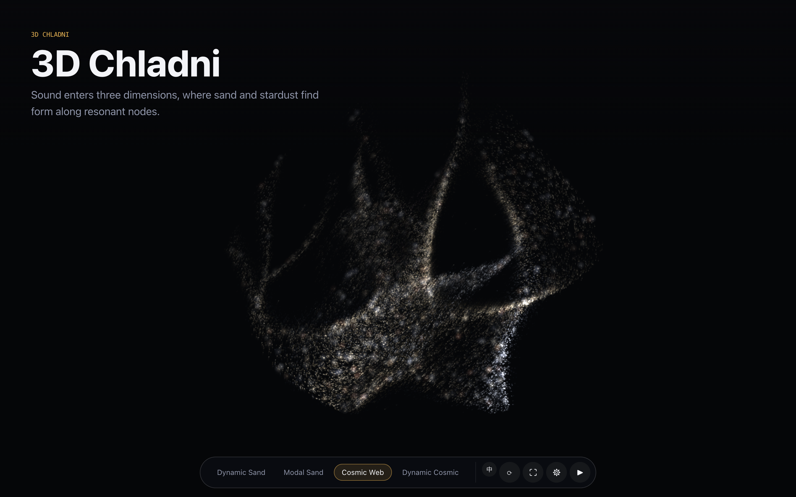
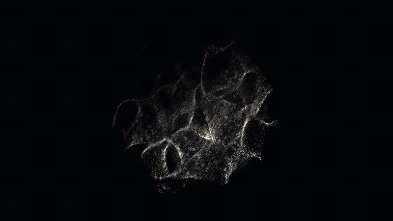
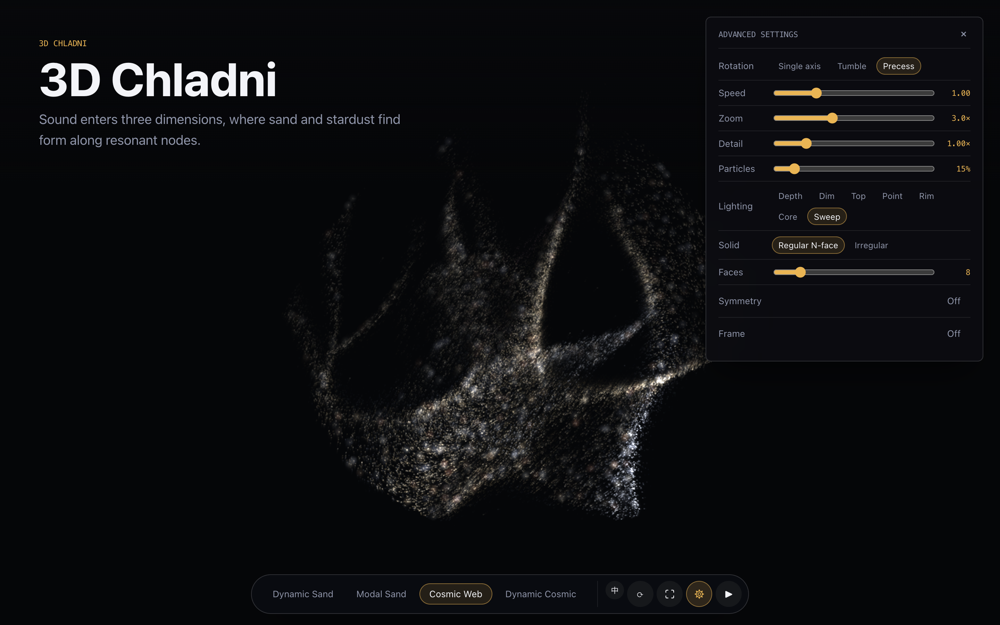
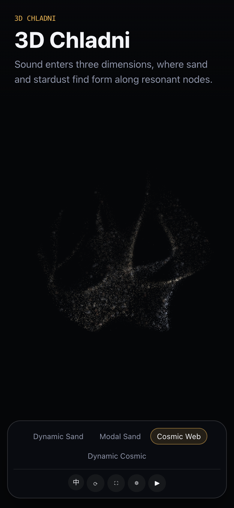

<p align="center">
  <a href="https://nolangz.github.io/3D-Chladni/"><strong>在线演示</strong></a>
</p>

<p align="center">
  <a href="README.md">English</a> | <strong>简体中文</strong>
</p>

<p align="center">
  <a href="https://github.com/nolangz/3D-Chladni/releases/latest/download/3D-Chladni-Web.zip"><strong>下载 Web 静态 HTML</strong></a> ·
  <a href="https://github.com/nolangz/3D-Chladni/releases/latest/download/3D-Chladni-Mac-Apple-Silicon.zip"><strong>下载 Mac 原生应用</strong></a> ·
  <a href="https://github.com/nolangz/3D-Chladni/releases/latest/download/3D-Chladni-Mac-Screen-Saver.zip"><strong>下载 Mac 壁纸 / 屏保</strong></a>
</p>

<p align="center"><sub>macOS 下载包已使用 Developer ID 签名并通过 Apple 公证。</sub></p>

<p align="center">
  
</p>

# 3D Chladni

把声音的频谱、节拍和能量投进三维克拉尼场。粒子不是贴图或预录动画，而是在模态共振、惯性迁移和三维投影中持续形成新的节面结构。

这个仓库目前包含三个可用应用：Web Demo、Mac 音乐可视化应用，以及 Mac 屏幕保护程序 / 锁屏动画。Windows 版作为社区方向，正在招募开发者贡献。

[English](README.md) · [720p MP4 演示](media/chladni-cosmic-demo.mp4) · [完整桌面说明](README.txt)

## 应用组成

| 应用 | 状态 | 说明 |
| --- | --- | --- |
| Web Demo | 可用 | 可直接部署到 GitHub Pages，内置 Lofi 驱动动态声沙和动态宇宙网 |
| Mac 音乐可视化应用 | 可用 | Electron 桌面应用，用户授权后跟随系统音频，支持透明浮层和全屏 |
| Mac 屏保 / 锁屏动画 | 可用 | 原生 Metal 实现，静态声沙和宇宙网已经做过计算与能耗优化 |
| Windows 音乐可视化应用 | 招募贡献者 | 已有跨平台 Electron 与打包基础，尚需完成 Windows 适配、设备测试和正式发布 |

> [!WARNING]
> **能耗提示：** Web Demo 和 Mac 音乐可视化应用会持续进行高密度粒子计算与实时渲染，耗电非常快，不建议在笔记本仅使用电池供电时运行。macOS 屏幕保护程序使用独立的原生 Metal 渲染路径，已经做过计算量和能耗优化。



## 四种视觉模式

| 模式 | 输入 | 默认细节 | 视觉行为 |
| --- | --- | --- | --- |
| 动态声沙 | Web 内置 Lofi / 用户音频 / 系统音频 | `1.5×` | 频谱驱动的惯性声沙迁移 |
| 模态声沙 | 无需音频 | `1.0×` | 稳定的克拉尼节面雕塑 |
| 宇宙网 | 无需音频 | `1.0×` | 三维粒子网络、进动与扫光 |
| 动态宇宙网 | Web 内置 Lofi / 用户音频 / 系统音频 | `1.5×` | 音乐驱动的模态混合与空间形变 |

四种模式分别记住当前会话中的细节调整值。默认粒子密度为 `15%`。动态模式带低频模态保护，低频占主导时仍保留可见的结构细节。

## Web 展示页

仓库根目录的 `index.html` 就是发布入口。它复用 `app/index.html` 的真实视觉内核，不维护第二套粒子实现。

- 底栏支持中文 / English 即时切换，并记住用户选择。
- 支持随机图案、全屏、暂停旋转和拖拽观察。
- 高级面板提供进动 / 单轴 / 翻滚、转速、缩放、细节、粒子、打光和立体形状控制。
- 全屏会隐藏标题、底栏和设置；`Esc` 退出。
- 移动端底栏自动换行，不产生横向溢出。

<table>
  <tr>
    <td width="70%"></td>
    <td width="30%"></td>
  </tr>
</table>

## 本地运行

macOS 可双击 `start.command`，或在仓库根目录运行：

```bash
python3 -m http.server 8777
```

打开 [http://localhost:8777/](http://localhost:8777/)。请使用 HTTP 服务，不要直接用 `file://` 打开；浏览器对本地音频初始化和 AudioContext 有额外限制。

## GitHub Pages

仓库已包含 `.github/workflows/pages.yml`。推送到 `main` 后，在仓库 **Settings → Pages → Source** 中选择 **GitHub Actions**，工作流会：

1. 检查 JavaScript 和发布脚本语法。
2. 打包 Web 壳层（`index.html`、`app/` 和兼容入口 `website/`）及相关许可证文件。
3. 将静态 artifact 发布到仓库对应的 `github.io` 地址。

相对路径已经适配项目型 Pages 地址，例如 `https://owner.github.io/repository/`。旧的 `/website/` 链接会保留查询参数和锚点并跳转到新首页。

手动构建与验证：

```bash
npm run build:pages
npm run verify:pages
```

## 应用能力边界

| 能力 | Web Demo | Mac 音乐可视化 | Mac 屏保 / 锁屏动画 |
| --- | --- | --- | --- |
| 动态声沙 / 动态宇宙网 | 支持 | 支持 | 不启用音频分析 |
| 模态声沙 / 宇宙网 | 支持 | 支持 | 支持 |
| 内置 Lofi 演示音频 | 支持 | 不加载、不打包 | 不需要音频 |
| 用户音频文件 / 麦克风 | 浏览器内支持 | 支持 | 不支持 |
| 系统音频 | 浏览器不提供通用接口 | 用户主动授权后支持 | 不支持 |
| 透明浮层与 menu bar | 不支持 | 支持 | 不适用 |
| 原生优化渲染 | 不支持 | 不支持 | 支持 |

Mac 音乐可视化应用继续复用 `app/index.html`，但 `electron-builder` 明确排除 `pulsebox-lofi-production-522875.mp3`。Mac 屏保则使用独立的原生 Metal 渲染路径，不启动 Electron、WebKit 或音频分析。

## Mac 音乐可视化应用

```bash
npm install
npm start
```

macOS 打包命令：

```bash
npm run package:mac
```

macOS 屏保和锁屏启动器的构建、安装及系统限制见 [README.txt](README.txt)。

## Windows 开发者招募

Windows 音乐可视化应用目前不作为已完成发布物。仓库已经具备 Electron 视觉内核、Windows 打包配置和系统音频接入基础，欢迎开发者通过 Issue / Pull Request 推进：

- Windows 10 / 11 与不同声卡、蓝牙设备下的 loopback 音频兼容性。
- 透明浮层、全屏、多显示器和不同 DPI 缩放组合的稳定性。
- 安装器、代码签名、自动更新和发布流程。
- GPU / CPU / 电池能耗测试，以及和 Mac / Web 视觉结果的对齐。

开发构建入口为 `npm run package:win`。在完成设备矩阵验证前，README 不将 Windows 版标记为正式支持。

## 架构

```text
index.html                  GitHub Pages / 本地 Web 展示壳
app/index.html              粒子物理、音频分析、Canvas 渲染真源
desktop/                    Electron 主进程、控制面板和系统音频桥
macos-screensaver/          原生 Metal 屏保
scripts/build-pages.sh      最小静态发布 artifact
scripts/verify-pages.cjs    Pages 路径、双语、默认值与音频验证
```

渲染器最多提交 `60 FPS`，隐藏页面时暂停视觉循环；粒子密度与 DPR 会按画布尺寸调整，质量降级优先关闭高成本后处理，而不是改变图案结构。

## 校验

```bash
npm run check
npm run smoke
npm run verify:web-audio
npm run verify:pages
npm run verify:mac-parity
```

发布素材可重新生成：

```bash
npm run capture:media
npm run export:video -- --output media/chladni-cosmic-demo.mp4 \
  --style cosmic --width 1280 --height 720 --fps 30 --seconds 6 \
  --codec h264 --rotation precess --rotation-speed 1 --seed 20260711
```

## 许可证

本仓库采用分范围授权，Apache-2.0 不覆盖媒体素材和第三方音乐：

| 范围 | 协议 |
| --- | --- |
| 源代码、构建脚本、配置与项目文档 | [Apache License 2.0](LICENSE) |
| `media/` 下的截图、GIF、MP4、宣传素材，以及独立粒子预设 | [CC BY-NC 4.0](ASSET_LICENSE.md) |
| Web 内置音乐 “Lofi Production” by PulseBox | [Pixabay Content License](THIRD_PARTY_NOTICES.md) |
| 名称、Logo 与应用图标 | 保留商标与品牌权利 |

Pixabay 音乐只作为 Web 交互视听作品的集成驱动音频使用，不得把原始 MP3 单独提取、转售或重新分发。代码贡献规则见 [CONTRIBUTING.md](CONTRIBUTING.md)。

## 发布检查

公开仓库前请完成 [RELEASE_CHECKLIST.md](RELEASE_CHECKLIST.md)，尤其要确认项目原创媒体的权属，以及 Pixabay 音乐始终作为交互视听作品的一部分提供，而不是独立分发。
